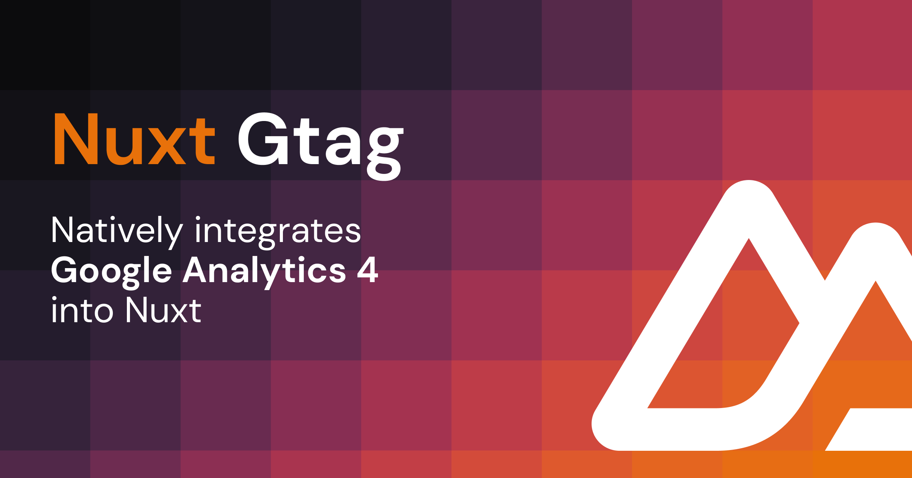

# Nuxt Gtag

[](https://www.npmjs.com/package/nuxt-gtag)

> [Nuxt 3](https://nuxt.com) module to integrate [Google Analytics 4](https://developers.google.com/analytics/devguides/collection/ga4?hl=en).

## Features

- 🌻 No dependencies except Google's `gtag.js`
- 🤝 Manual [consent management](#consent-management) for GDPR compliance
- 📯 Track events manually with [composables](#composables)
- 🦾 SSR-ready
- 📂 [`.env` file support](#configuration)

## Setup

```bash
# pnpm
pnpm add -D nuxt-gtag

# npm
npm i -D nuxt-gtag
```

## Basic Usage

Add `nuxt-gtag` to the `modules` section of your Nuxt configuration and provide your Google Analytics measurement ID.

```ts
// `nuxt.config.ts`
export default defineNuxtConfig({
  modules: ['nuxt-gtag'],

  gtag: {
    id: 'G-XXXXXXXXXX'
  }
})
```

Done! Google Analytics will now run in your application's client.

> **Note**
>
> Ensure that the **Enhanced measurement** feature is enabled to allow GA4 to automatically track page views in your Single Page Application.
>
> To enable this feature, go to your Google Analytics 4 account, then navigate to "Admin" > "Data Streams" > "Web" > "Enhanced measurement settings." In this section, make sure the "Page views" toggle is enabled. Enabling the "Page views" toggle allows GA4 to track page changes based on browser history events in your Single Page Application.

## Configuration

All [supported module options](#module-options) can be configured using the `gtag` key in your Nuxt configuration:

```ts
export default defineNuxtConfig({
  modules: ['nuxt-gtag'],

  gtag: {
    id: 'G-XXXXXXXXXX',
    config: {
      page_title: 'My Custom Page Title'
    }
  }
})
```

### Consent Management

If you want to disable tracking by default, you can set the `initialConsent` option to `false`. This will prevent the `gtag.js` script from loading until the user has consented to tracking.

```ts
export default defineNuxtConfig({
  modules: ['nuxt-gtag'],

  gtag: {
    id: 'G-XXXXXXXXXX',
    initialConsent: false
  }
})
```

To manually manage consent, you can use the [`useGtagConsent` composable](#usegtagconsent) to set the consent state, e.g. after the user has accepted your cookie policy.

```vue
<script setup lang="ts">
function acceptTracking() {
  useGtagConsent(true)
}
</script>

<template>
  <button @click="acceptTracking">
    Accept Tracking
  </button>
</template>
```

### Runtime Config

Alternatively, leveraging [automatically replaced public runtime config values](https://nuxt.com/docs/api/configuration/nuxt-config#runtimeconfig) by matching environment variables at runtime, set your desired option in your project's `.env` file:

```bash
# Sets the `gtag.id` module option
NUXT_PUBLIC_GTAG_ID=G-XXXXXXXXXX
```

With this setup, you can omit the `gtag` key in your Nuxt configuration if you only want to set the measurement ID.

## Module Options

| Option | Type | Default | Description |
| --- | --- | --- | --- |
| `id` | `string` | `undefined` | The Google Analytics measurement ID. |
| `config` | `Record<string, any>` | `{}` | The [configuration parameters](https://developers.google.com/analytics/devguides/collection/ga4/reference/config) to be passed to `gtag.js` on initialization. |
| `initialConsent` | `boolean` | `true` | Whether to initially consent to tracking. |
| `loadingStrategy` | `'async' \| 'defer'` | `'defer'` | The loading strategy to be used for the `gtag.js` script. |

## Composables

As with other composables in the Nuxt 3 ecosystem, they are auto-imported and can be used in your application's components.

### `useGtag`

The `useGtag` composable is SSR-safe and can be used to call any of the [gtag.js methods](https://developers.google.com/tag-platform/gtagjs/reference).

```ts
// SSR-ready
const gtag = useGtag()
gtag(
  // <command>,
  // <command-parameters>
)
```

> ℹ️ Since the Gtag instance is available in the client only, any `gtag()` (assuming the variable from above) calls executed on the server will have no effect.

**Type Declarations**

```ts
function useGtag(): {
  (command: 'config', targetId: string, config?: Record<string, any>): void
  (command: 'event', eventName: string & {}, eventParams?: Record<string, any>): void
  (command: 'set', targetId: string, config: string | boolean | Record<string, any>): void
  (command: 'set', config: Record<string, any>): void
  (command: 'get', targetId: string, fieldName: string, callback?: (field?: string | Record<string, any>) => void): void
  (command: 'consent', consentArg: string, consentParams: Record<string, any>): void
  (command: 'js', config: Date): void
}
```

**Example**

The following event command fires the event `screen_view` with two parameters: `app_name` and `screen_name`.

```ts
// SSR-ready
const gtag = useGtag()
gtag('event', 'screen_view', {
  app_name: 'My App',
  screen_name: 'Home'
})
```

### `useGtagConsent`

If you want to manually manage consent, i.e. for GDPR compliance, you can use the `useGtagConsent` composable to set the consent state. This composable accepts a boolean value that indicates whether the user has consented to tracking. If the user has consented, the `gtag.js` script will be loaded and tracking will begin.

This is only necessary if you have disabled the `initialConsent` option.

```ts
useGtagConsent(true)
```

> ℹ️ Since the Gtag instance is available in the client only, executing the composable on the server will have no effect.

**Type Declarations**

```ts
function useGtagConsent(hasConsent: boolean): void
```

### `useTrackEvent`

Track your defined goals by passing the following parameters:

- The name of the recommended or custom event
- A collection of parameters that provide additional information about the event (optional)

> ℹ️ Since the Gtag instance is available in the client only, executing the composable on the server will have no effect.

**Type Declarations**

```ts
function useTrackEvent(
  eventName: (string & {}),
  eventParams?: Record<string, any>
): void
```

**Example**

For example, the following is an event called `login` with a parameter `method`:

```ts
// Tracks the `login` event
useTrackEvent('login', {
  method: 'Google'
})
```

## 💻 Development

1. Clone this repository
2. Enable [Corepack](https://github.com/nodejs/corepack) using `corepack enable`
3. Install dependencies using `pnpm install`
4. Run `pnpm run dev:prepare`
5. Start development server using `pnpm run dev`

## Credits

- [SVGBackgrounds.com](https://www.svgbackgrounds.com) for the OpenGraph image background pattern.

## License

[MIT](./LICENSE) License © 2023-present [Johann Schopplich](https://github.com/johannschopplich)
