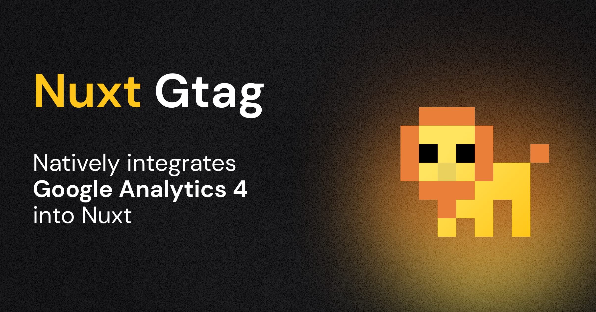

# Nuxt Gtag

[](https://www.npmjs.com/package/nuxt-gtag)

> [Nuxt](https://nuxt.com) module to integrate [Google Analytics 4](https://developers.google.com/analytics/devguides/collection/ga4?hl=en).

## Features

- 🌻 No dependencies except Google's `gtag.js`
- 🤝 Manual [consent management](#consent-management) for GDPR compliance
- 📯 Track events manually with [composables](#composables)
- 🏷️ Fully typed `gtag.js` API
- 🦾 SSR-ready
- 📂 [`.env` file support](#configuration)

## Setup

```bash
# pnpm
pnpm add -D nuxt-gtag

# npm
npm i -D nuxt-gtag

# yarn
yarn add -D nuxt-gtag
```

## Basic Usage

Add `nuxt-gtag` to the `modules` section of your Nuxt configuration and provide your Google Analytics measurement ID.

```ts
// `nuxt.config.ts`
export default defineNuxtConfig({
  modules: ['nuxt-gtag'],

  gtag: {
    id: 'G-XXXXXXXXXX'
  }
})
```

Done! Google Analytics will now run in your application's client.

> [!NOTE]
> Ensure that the **Enhanced measurement** feature is enabled to allow `gtag.js` to automatically track page changes based on browser history events in Nuxt.
>
> To enable this feature:
>
> 1. Go to the GA4 reporting view and click on “Admin”
> 2. Select “Data Streams” under the “Property” column.
> 3. Click on your web data stream.
> 4. Next, toggle the switch button near “Enhanced measurement”.

## Configuration

All [supported module options](#module-options) can be configured using the `gtag` key in your Nuxt configuration:

```ts
export default defineNuxtConfig({
  modules: ['nuxt-gtag'],

  gtag: {
    // The Google Analytics 4 property ID to use for tracking
    id: 'G-XXXXXXXXXX',
    // Additional configuration for the Google Analytics 4 property
    config: {
      page_title: 'My Custom Page Title'
    }
  }
})
```

### Runtime Config

Instead of hard-coding your measurement ID in your Nuxt configuration, you can set your desired option in your project's `.env` file, leveraging [automatically replaced public runtime config values](https://nuxt.com/docs/api/configuration/nuxt-config#runtimeconfig) by matching environment variables at runtime.

```ini
# Overwrites the `gtag.id` module option
NUXT_PUBLIC_GTAG_ID=G-XXXXXXXXXX
```

With this setup, you can omit the `gtag` key in your Nuxt configuration if you only intend to set the measurement ID.

### Consent Management

If you want to disable tracking by default, you can set the `initialConsent` option to `false`. This will prevent the `gtag.js` script from loading until the user has consented to tracking.

```ts
export default defineNuxtConfig({
  modules: ['nuxt-gtag'],

  gtag: {
    id: 'G-XXXXXXXXXX',
    initialConsent: false
  }
})
```

To manually manage consent, you can use the [`grantConsent` method destructurable from `useGtag`](#usegtag) to set the consent state, e.g. after the user has accepted your cookie policy.

```vue
<script setup lang="ts">
const { gtag, grantConsent, revokeConsent } = useGtag()
</script>

<template>
  <button @click="grantConsent()">
    Accept Tracking
  </button>
</template>
```

You can even leave the measurement ID in your Nuxt config blank and set it dynamically later in your application by passing your ID as the first argument to `grantConsent`. This is especially useful if you want to use a custom ID for each user or if your app manages multiple tenants.

```ts
const { gtag, grantConsent, revokeConsent } = useGtag()

function acceptTracking() {
  grantConsent('G-XXXXXXXXXX')
}
```

## Module Options

| Option | Type | Default | Description |
| --- | --- | --- | --- |
| `id` | `string` | `undefined` | The Google Analytics measurement ID. |
| `config` | `Record<string, any>` | `{}` | The [configuration parameters](https://developers.google.com/analytics/devguides/collection/ga4/reference/config) to be passed to `gtag.js` on initialization. |
| `initialConsent` | `boolean` | `true` | Whether to initially consent to tracking. |
| `loadingStrategy` | `'async' \| 'defer'` | `'defer'` | The loading strategy to be used for the `gtag.js` script. |

## Composables

As with other composables in the Nuxt 3 ecosystem, they are auto-imported and can be used in your application's components.

### `useGtag`

The SSR-safe `useGtag` composable provides access to:

- The `gtag.js` instance
- The `grantConsent` method
- The `revokeConsent` method

It can be used as follows:

```ts
// Each method is destructurable from the composable and can be
// used on the server and client-side
const { gtag, grantConsent, revokeConsent } = useGtag()
```

**Type Declarations**

```ts
function useGtag(): {
  gtag: Gtag
  grantConsent: (id?: string) => void
  revokeConsent: (id?: string) => void
}
```

#### `gtag`

The `gtag` function is the main interface to the `gtag.js` instance and can be used to call any of the [gtag.js methods](https://developers.google.com/tag-platform/gtagjs/reference).

```ts
const { gtag } = useGtag()

// SSR-ready
gtag('event', 'screen_view', {
  app_name: 'My App',
  screen_name: 'Home'
})
```

> [!NOTE]
> Since the `gtag.js` instance is available in the client only, any `gtag()` calls executed on the server will have no effect.

**Type Declarations**

```ts
const gtag: {
  (command: 'config', targetId: string, config?: ControlParams | EventParams | ConfigParams | Record<string, any>): void
  (command: 'set', targetId: string, config: string | boolean | Record<string, any>): void
  (command: 'set', config: Record<string, any>): void
  (command: 'js', config: Date): void
  (command: 'event', eventName: EventNames | (string & Record<never, never>), eventParams?: ControlParams | EventParams | Record<string, any>): void
  (command: 'get', targetId: string, fieldName: FieldNames | string, callback?: (field?: string | Record<string, any>) => any): void
  (command: 'consent', consentArg: ConsentArg | string, consentParams: ConsentParams): void
}
```

**Example**

The following event command fires the event `screen_view` with two parameters: `app_name` and `screen_name`.

```ts
const { gtag } = useGtag()

// SSR-ready
gtag('event', 'screen_view', {
  app_name: 'My App',
  screen_name: 'Home'
})
```

#### `grantConsent`

If you want to manually manage consent, i.e. for GDPR compliance, you can use the `grantConsent` method to grant the consent. Make sure to set `initialConsent` to `false` in the module options beforehand.

This function accepts an optional ID in case you want to initialize a custom Gtag ID and haven't set it in the module options.

```ts
const { grantConsent } = useGtag()

// When called, the `gtag.js` script will be loaded and tracking will begin
grantConsent()
```

> [!NOTE]
> Although this method is SSR-safe, the `gtag.js` script will be loaded in the client only. Make sure to run this method in the client.

**Type Declarations**

```ts
function grantConsent(id?: string): void
```

#### `revokeConsent`

If a user has previously granted consent, you can use the `revokeConsent` method to revoke the consent. This will prevent the `gtag.js` script from tracking any events until the consent is granted again.

This function accepts an optional ID in case you haven't set it in the module options. Make sure to pass the same ID that was used to grant the consent.

```ts
const { revokeConsent } = useGtag()

// When called, the `gtag.js` script will be stopped from tracking events
revokeConsent()
```

**Type Declarations**

```ts
function revokeConsent(id?: string): void
```

### `useTrackEvent`

Track your defined goals by passing the following parameters:

- The name of the recommended or custom event.
- A collection of parameters that provide additional information about the event (optional).

> [!NOTE]
> This composable is SSR-ready. But since the `gtag.js` instance is available in the client only, executing the composable on the server will have no effect.

**Type Declarations**

```ts
function useTrackEvent(
  eventName: EventNames | (string & Record<never, never>),
  eventParams?: ControlParams | EventParams | Record<string, any>,
): void
```

**Example**

For example, the following is an event called `login` with a parameter `method`:

```ts
// Tracks the `login` event
useTrackEvent('login', {
  method: 'Google'
})
```

## 💻 Development

1. Clone this repository
2. Enable [Corepack](https://github.com/nodejs/corepack) using `corepack enable`
3. Install dependencies using `pnpm install`
4. Run `pnpm run dev:prepare`
5. Start development server using `pnpm run dev`

## Credits

- [Maronbeere](https://maronbeere.carrd.co) for his logo pixel art.
- [Junyoung Choi](https://github.com/rokt33r) and [Lucas Akira Uehara](https://github.com/KsAkira10) for their Google [`gtag.js` API type definitions](https://www.npmjs.com/package/@types/gtag.js)


## License

[MIT](./LICENSE) License © 2023-present [Johann Schopplich](https://github.com/johannschopplich)
