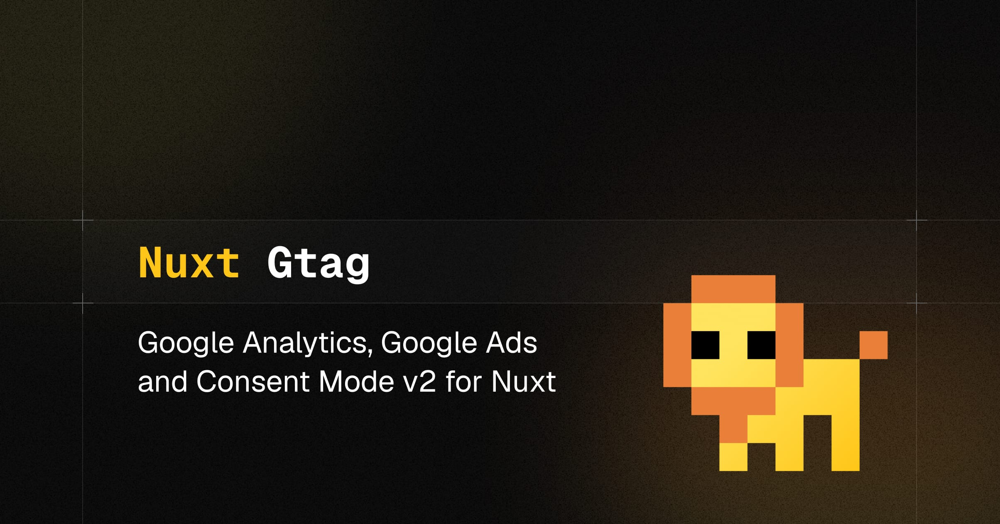

# Nuxt Google Tag

[Google Analytics](https://developers.google.com/analytics/devguides/collection/ga4?hl=en), Google Ads and [Consent Mode v2](https://developers.google.com/tag-platform/security/guides/consent) for [Nuxt](https://nuxt.com), through Google's own [`gtag.js`](https://developers.google.com/tag-platform/gtagjs?hl=en).

- [✨ &nbsp;Release Notes](https://github.com/johannschopplich/nuxt-gtag/releases)

## Features

- 🌻 Loads no tracking library of its own, only Google's `gtag.js`
- 🛍️ Use Google Analytics 4, Google Ads and other products
- 🛎️ Supports [Google Consent Mode v2](#google-consent-mode)
- 🤝 Manually [initialize](#manually-load-gtagjs-script) a Google tag
- 🔢 Supports [multiple tag IDs](#multiple-google-tags)
- 📯 Track events with [composables](#composables)
- 🏷️ Fully typed `gtag.js` API
- 🦾 SSR-ready

## Setup

```bash
npx nuxt module add gtag
```

## Basic Usage

Add `nuxt-gtag` to the `modules` section of your Nuxt configuration and provide your Google tag ID (for multiple tag IDs, see below).

```ts
// `nuxt.config.ts`
export default defineNuxtConfig({
  modules: ['nuxt-gtag'],

  gtag: {
    id: 'G-XXXXXXXXXX'
  }
})
```

Done! The `gtag.js` script will be loaded and initialized client-side with your Google tag ID when the Nuxt application starts.

> [!NOTE]
> Ensure that the **Enhanced measurement** feature is enabled to allow `gtag.js` to automatically track page changes based on browser history events in Nuxt.
>
> To enable this feature:
>
> 1. Go to the GA4 reporting view and click on "Admin".
> 2. Select "Data Streams" under the "Property" column.
> 3. Click on your web data stream.
> 4. Expand the "Enhanced measurement" switch button.
> 5. Ensure the "Page changes based on browser history events" switch button is enabled.

## Configuration

All [supported module options](#module-options) can be configured using the `gtag` key in your Nuxt configuration:

```ts
export default defineNuxtConfig({
  modules: ['nuxt-gtag'],

  gtag: {
    id: 'G-XXXXXXXXXX',
    config: {
      page_title: 'My Custom Page Title'
    }
  }
})
```

### Conditional Enable/Disable of the Module

You may want to disable the Google tag module in certain environments, such as development or staging. To do this, set the `enabled` option to `false`.

> [!NOTE]
> Composables like `useGtag` and `useTrackEvent` are still importable when the module is disabled. In this case, the functions are replaced with no-ops to avoid type and logic errors.

```ts
export default defineNuxtConfig({
  modules: ['nuxt-gtag'],

  gtag: {
    enabled: process.env.NODE_ENV === 'production',
    id: 'G-XXXXXXXXXX'
  }
})
```

### Multiple Google Tags

If you want to send data to multiple destinations, you can add more than one Google tag ID to your Nuxt configuration in the `tags` module option. Pass a string (single tag ID) or an object (tag ID with additional configuration) to the `tags` array.

Here, the second tag sends to a Floodlight destination:

```ts
export default defineNuxtConfig({
  modules: ['nuxt-gtag'],

  gtag: {
    tags: [
      // Google Ads and GA4, with additional configuration
      {
        id: 'G-XXXXXXXXXX',
        config: {
          page_title: 'My Custom Page Title'
        }
      },
      // Second Google tag ID for Floodlight
      'DC-ZZZZZZZZZZ'
    ]
  }
})
```

### Runtime Config

Instead of hard-coding your Google tag ID in your Nuxt configuration, set it in your project's `.env` file – Nuxt overwrites [public runtime config values](https://nuxt.com/docs/api/nuxt-config#runtimeconfig) with matching environment variables at runtime.

```ini
# Overwrites the `gtag.id` module option
NUXT_PUBLIC_GTAG_ID=G-XXXXXXXXXX
```

With this setup, you can omit the `gtag` key in your Nuxt configuration if you only intend to set the Google tag ID.

### Google Consent Mode

> [!TIP]
> Follows the [Google Consent Mode v2](https://developers.google.com/tag-platform/security/guides/consent) specification.

Set a default value for each consent type you use. Without `initCommands`, no consent mode values are set:

```ts
export default defineNuxtConfig({
  modules: ['nuxt-gtag'],

  gtag: {
    id: 'G-XXXXXXXXXX',
    initCommands: [
      // Set up consent mode
      ['consent', 'default', {
        ad_user_data: 'denied',
        ad_personalization: 'denied',
        ad_storage: 'denied',
        analytics_storage: 'denied',
        wait_for_update: 500,
      }]
    ]
  }
})
```

After a user indicates their consent choices, update relevant parameters to `granted`:

```ts
function allConsentGranted() {
  const { gtag } = useGtag()
  gtag('consent', 'update', {
    ad_user_data: 'granted',
    ad_personalization: 'granted',
    ad_storage: 'granted',
    analytics_storage: 'granted'
  })
}

function consentGrantedAdStorage() {
  const { gtag } = useGtag()
  gtag('consent', 'update', {
    ad_storage: 'granted'
  })
}

// Invoke the consent function when a user interacts with your banner
consentGrantedAdStorage() // Or `allConsentGranted()`
```

### Manually Load `gtag.js` Script

For even more control than the [consent mode](#google-consent-mode), you can delay the loading of the `gtag.js` script until the user has granted consent to your privacy policy. Set the `initMode` option to `manual` to prevent loading the `gtag.js` script until you initialize it manually.

```ts
export default defineNuxtConfig({
  modules: ['nuxt-gtag'],

  gtag: {
    initMode: 'manual',
    id: 'G-XXXXXXXXXX'
  }
})
```

To manually load the Google tag script, e.g. after the user has accepted your privacy policy, use the [`initialize` method destructurable from `useGtag`](#usegtag):

```vue
<script setup lang="ts">
const { gtag, initialize } = useGtag()
</script>

<template>
  <button @click="initialize()">
    Grant Consent
  </button>
</template>
```

### Multi-Tenancy

Leave the Google tag ID in your Nuxt configuration blank and pass it to `initialize` as the first argument instead. Reach for this when each user or tenant brings their own ID.

```ts
const { initialize } = useGtag()

function acceptTracking() {
  initialize('G-TENANT-123')
  // Optionally, track the current page view
  // useTrackEvent('page_view')
}
```

[Consent defaults](#google-consent-mode) do not need a static `id` either. Set `initCommands` on their own, and they run before the tenant's ID is configured:

```ts
export default defineNuxtConfig({
  modules: ['nuxt-gtag'],

  gtag: {
    initMode: 'manual',
    initCommands: [
      ['consent', 'default', {
        analytics_storage: 'denied',
        wait_for_update: 500,
      }]
    ]
  }
})
```

## Module Options

| Option | Type | Default | Description |
| --- | --- | --- | --- |
| `enabled` | `boolean` | `true` | Whether to enable the Google tag module for the current environment. |
| `initMode` | `'auto' \| 'manual'` | `'auto'` | Whether to initialize the Google tag script immediately after the page has loaded. Set it to `'manual'` to initialize with [`initialize`](#initialize) instead. |
| `id` | `string` | `''` | The Google tag ID to initialize. |
| `initCommands` | `[command, ...args][]` | `[]` | Commands to run before the tag ID is configured, such as the [default consent state](#google-consent-mode). |
| `config` | `ControlParams \| EventParams \| ConfigParams \| CustomParams` | `{}` | The [configuration parameters](https://developers.google.com/analytics/devguides/collection/ga4/reference/config) passed to the `config` command. |
| `tags` | `(string \| GoogleTagOptions)[]` | `[]` | Further tag IDs to initialize, for sending data to more than one destination. |
| `loadingStrategy` | `'async' \| 'defer'` | `'defer'` | Whether the `gtag.js` script is loaded with `async` or with `defer`. |
| `url` | `string` | `'https://www.googletagmanager.com/gtag/js'` | The URL to load the `gtag.js` script from. |

## Composables

As with other composables in the Nuxt ecosystem, they are auto-imported and can be used in your application's components.

> [!NOTE]
> Every composable here is SSR-safe, but the `gtag.js` instance lives in the client only. On the server the calls have no effect.

### `useGtag`

```ts
const { gtag, initialize, disableAnalytics, enableAnalytics } = useGtag()
```

**Type Declarations**

```ts
function useGtag(): {
  gtag: Gtag
  initialize: (id?: string) => void
  disableAnalytics: (id?: string) => void
  enableAnalytics: (id?: string) => void
}
```

#### `gtag`

The `gtag` function is the main interface to the `gtag.js` instance and can be used to run every [gtag.js command](https://developers.google.com/tag-platform/gtagjs/reference).

**Example**

The following event command fires the event `screen_view` with two parameters: `app_name` and `screen_name`.

```ts
const { gtag } = useGtag()

gtag('event', 'screen_view', {
  app_name: 'My App',
  screen_name: 'Home'
})
```

**Type Declarations**

```ts
interface GtagCommands {
  config: [targetId: string, config?: ControlParams | EventParams | ConfigParams | CustomParams]
  set: [targetId: string, config: CustomParams | boolean | string] | [config: CustomParams]
  js: [config: Date]
  event: [eventName: EventNames | (string & {}), eventParams?: ControlParams | EventParams | CustomParams]
  get: [
      targetId: string,
      fieldName: FieldNames | string,
      callback?: (field?: string | CustomParams) => any,
  ]
  consent: [consentArg: ConsentArg | (string & {}), consentParams: ConsentParams]
}

const gtag: {
  <Command extends keyof GtagCommands>(command: Command, ...args: GtagCommands[Command]): void
}
```

#### `initialize`

Injects the `gtag.js` script into the document's head and configures the tag IDs. Requires [`initMode: 'manual'`](#manually-load-gtagjs-script) in the module options.

The function accepts an optional ID for a Google tag that the module options do not carry. The ID joins the ones from your configuration rather than replacing them, so the call configures that tag *and* every tag still waiting.

A tag ID is configured once. Calling `initialize` again passes only the IDs it hasn't configured yet to the `config` command, so a consent flow may call it as often as it needs to.

**Example**

```ts
const { initialize } = useGtag()

// Loads the script and configures every tag ID from the module options
initialize()
```

**Type Declarations**

```ts
function initialize(id?: string): void
```

#### `disableAnalytics`

In some cases, it may be necessary to disable Google Analytics without removing the Google tag. For example, you might want to provide users with the option to opt out of tracking.

The `gtag.js` library includes a `window['ga-disable-GA_MEASUREMENT_ID']` property that, when set to `true`, disables `gtag.js` from sending data to Google Analytics.

The optional ID names the tag to switch off. It covers one tag, so a setup with [multiple tag IDs](#multiple-google-tags) needs one call per tag – without an argument, only the first configured tag is affected.

**Example**

```ts
const { disableAnalytics } = useGtag()

disableAnalytics()
```

**Type Declarations**

```ts
function disableAnalytics(id?: string): void
```

#### `enableAnalytics`

The `enableAnalytics` method is the counterpart to `disableAnalytics` and can be used to re-enable Google Analytics after it has been disabled. Its `id` parameter selects the tag the same way.

**Example**

```ts
const { enableAnalytics } = useGtag()

enableAnalytics()
```

**Type Declarations**

```ts
function enableAnalytics(id?: string): void
```

### `useTrackEvent`

Fires an event, optionally with a set of event parameters.

- The name of the recommended or custom event.
- A collection of parameters that provide additional information about the event (optional).

**Example**

The following fires an event called `login` with a parameter `method`:

```ts
useTrackEvent('login', {
  method: 'Google'
})
```

**Type Declarations**

```ts
function useTrackEvent(
  eventName: EventNames | (string & {}),
  eventParams?: ControlParams | EventParams | CustomParams
): void
```

## 💻 Development

1. Clone this repository
2. Enable [Corepack](https://github.com/nodejs/corepack) using `corepack enable`
3. Install dependencies using `pnpm install`
4. Run `pnpm run dev:prepare`
5. Start development server using `pnpm run dev`

## Credits

- [Konkon](https://konkon.zip) for his logo pixel art.
- [Junyoung Choi](https://github.com/rokt33r) and [Lucas Akira Uehara](https://github.com/KsAkira10) for their Google [`gtag.js` API type definitions](https://www.npmjs.com/package/@types/gtag.js)

## License

[MIT](./LICENSE) License © 2023-PRESENT [Johann Schopplich](https://github.com/johannschopplich)
