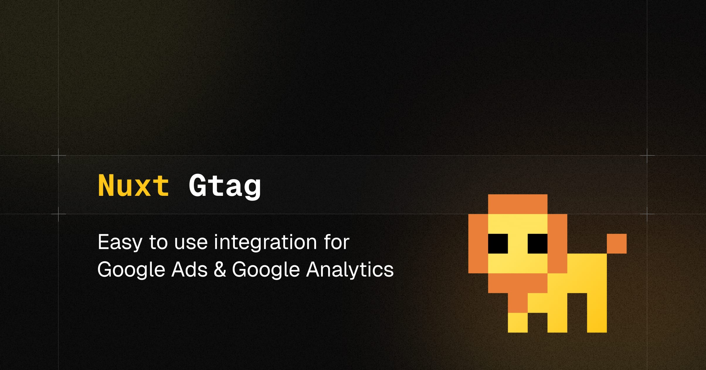

# Nuxt Google Tag

[Google Tag](https://developers.google.com/tag-platform/gtagjs?hl=en) integration for [Nuxt](https://nuxt.com) with support for [Google Analytics 4](https://developers.google.com/analytics/devguides/collection/ga4?hl=en), Google Ads and more.

## Features

- 🌻 Zero dependencies except Google's `gtag.js`
- 🛍️ Use Google Analytics 4, Google Ads and other products
- 🛎️ Supports [Google Consent Mode v2](#google-consent-mode)
- 🤝 Manually [initialize](#manually-load-gtagjs-script) a Google tag
- 🔢 Supports [multiple tag IDs](#multiple-google-tags)
- 📯 Track events with [composables](#composables)
- 🏷️ Fully typed `gtag.js` API
- 🦾 SSR-ready

## Setup

```bash
npx nuxi@latest module add gtag
```

## Basic Usage

Add `nuxt-gtag` to the `modules` section of your Nuxt configuration and provide your Google tag ID (for multiple tag IDs, see below).

```ts
export default defineNuxtConfig({
  modules: ['nuxt-gtag'],

  gtag: {
    id: 'G-XXXXXXXXXX'
  }
})
```

Done! The `gtag.js` script will be loaded and initialized client-side with your Google tag ID when the Nuxt application starts.

> [!NOTE]
> Ensure that the **Enhanced measurement** feature is enabled to allow `gtag.js` to automatically track page changes based on browser history events in Nuxt.
>
> To enable this feature:
>
> 1. Go to the GA4 reporting view and click on “Admin”
> 2. Select “Data Streams” under the “Property” column.
> 3. Click on your web data stream.
> 4. Next, expand the switch button “Enhanced measurement”.
> 5. Ensure the “Page changes based on browser history events” switch button is enabled.

## Configuration

All [supported module options](#module-options) can be configured using the `gtag` key in your Nuxt configuration. An example of some of the options you can set:

```ts
export default defineNuxtConfig({
  modules: ['nuxt-gtag'],

  gtag: {
    // Your primary Google tag ID
    id: 'G-XXXXXXXXXX',
    // Additional configuration for this tag ID
    config: {
      page_title: 'My Custom Page Title'
    },
  }
})
```

### Multiple Google Tags

If you want to send data to multiple destinations, you can add more than one Google tag ID to your Nuxt configuration in the `tags` module option. Pass a string (single tag ID) or an object (tag ID with additional configuration) to the `tags` array.

The following example shows how to load a second Google tag that is connected to a Floodlight destination:

```ts
export default defineNuxtConfig({
  modules: ['nuxt-gtag'],

  gtag: {
    tags: [
      // Google Ads and GA4, with additional configuration
      {
        id: 'G-XXXXXXXXXX',
        config: {
          page_title: 'My Custom Page Title'
        }
      },
      // Second Google tag ID for Floodlight
      'DC-ZZZZZZZZZZ'
    ]
  }
})
```

### Runtime Config

Instead of hard-coding your Google tag ID in your Nuxt configuration, you can set your desired option in your project's `.env` file, leveraging [automatically replaced public runtime config values](https://nuxt.com/docs/api/nuxt-config#runtimeconfig) by matching environment variables at runtime.

```ini
# Overwrites the `gtag.id` module option
NUXT_PUBLIC_GTAG_ID=G-XXXXXXXXXX
```

With this setup, you can omit the `gtag` key in your Nuxt configuration if you only intend to set the Google tag ID.

### Google Consent Mode

> [!TIP]
> Follows the [Google Consent Mode v2](https://developers.google.com/tag-platform/security/guides/consent) specification.

Set a default value for each consent type you are using. By default, no consent mode values are set.

The following example sets multiple consent mode parameters to denied by default:

```ts
export default defineNuxtConfig({
  modules: ['nuxt-gtag'],

  gtag: {
    id: 'G-XXXXXXXXXX',
    initCommands: [
      // Setup up consent mode
      ['consent', 'default', {
        ad_user_data: 'denied',
        ad_personalization: 'denied',
        ad_storage: 'denied',
        analytics_storage: 'denied',
        wait_for_update: 500,
      }]
    ]
  }
})
```

After a user indicates their consent choices, update relevant parameters to `granted`:

```ts
function allConsentGranted() {
  const { gtag } = useGtag()
  gtag('consent', 'update', {
    ad_user_data: 'granted',
    ad_personalization: 'granted',
    ad_storage: 'granted',
    analytics_storage: 'granted'
  })
}

function consentGrantedAdStorage() {
  const { gtag } = useGtag()
  gtag('consent', 'update', {
    ad_storage: 'granted'
  })
}

// Invoke the consent function when a user interacts with your banner
consentGrantedAdStorage() // Or `allConsentGranted()`
```

### Manually Load `gtag.js` Script

For even more control than the [consent mode](#google-consent-mode), you can delay the loading of the `gtag.js` script until the user has granted consent to your privacy policy. Set the `enabled` option to `false` to prevent loading the `gtag.js` script until you manually enable it:

```ts
export default defineNuxtConfig({
  modules: ['nuxt-gtag'],

  gtag: {
    enabled: false,
    id: 'G-XXXXXXXXXX'
  }
})
```

To manually load the Google tag script, i.e. after the user has accepted your privacy policy, you can use the [`initialize` method destructurable from `useGtag`](#usegtag):

```vue
<script setup lang="ts">
const { gtag, initialize } = useGtag()
</script>

<template>
  <button @click="initialize()">
    Grant Consent
  </button>
</template>
```

### Multi-Tenancy Support

You can even leave the Google tag ID in your Nuxt config blank and set it dynamically later in your application by passing your ID as the first argument to `initialize`. This is especially useful if you want to use a custom ID for each user or if your app manages multiple tenants.

```ts
const { gtag, initialize } = useGtag()

function acceptTracking() {
  initialize('G-XXXXXXXXXX')
  // Optionally, track the current page view
  // useTrackEvent('page_view')
}
```

## Module Options

| Option | Type | Default | Description |
| --- | --- | --- | --- |
| `enabled` | `boolean` | `true` | Whether to initialize the Google tag script immediately after the page has loaded. |
| `id` | `string` | `undefined` | The Google tag ID to initialize. |
| `initCommands` | See `initCommands` of `GoogleTagOptions` | `[]` | Commands to be executed when the Google tag ID is initialized. |
| `config` | See `config` of `GoogleTagOptions` | `{}` | The [configuration parameters](https://developers.google.com/analytics/devguides/collection/ga4/reference/config) to be passed to `gtag.js` on initialization. |
| `tags` | `string[] \| GoogleTagOptions[]` | `[]` | Multiple Google tag IDs to initialize for sending data to different destinations. |
| `loadingStrategy` | `'async' \| 'defer'` | `'defer'` | The loading strategy to be used for the `gtag.js` script. |
| `url` | `string` | [Source](https://www.googletagmanager.com/gtag/js) | The URL to the `gtag.js` script. Use this option to load the script from a custom URL. |

## Composables

As with other composables in the Nuxt 3 ecosystem, they are auto-imported and can be used in your application's components.

### `useGtag`

The SSR-safe `useGtag` composable provides access to:

- The `gtag.js` instance
- The `initialize` method
- The `disableAnalytics` method
- The `enableAnalytics` method

It can be used as follows:

```ts
// Each method is destructurable from the composable and can be
// used on the server and client-side
const { gtag, initialize, disableAnalytics, enableAnalytics } = useGtag()
```

**Type Declarations**

```ts
function useGtag(): {
  gtag: Gtag
  initialize: (id?: string) => void
  disableAnalytics: (id?: string) => void
  enableAnalytics: (id?: string) => void
}
```

#### `gtag`

The `gtag` function is the main interface to the `gtag.js` instance and can be used to run every [gtag.js command](https://developers.google.com/tag-platform/gtagjs/reference).

> [!NOTE]
> Since the `gtag.js` instance is available in the client only, any `gtag()` calls executed on the server will have no effect.

**Example**

The following event command fires the event `screen_view` with two parameters: `app_name` and `screen_name`.

```ts
const { gtag } = useGtag()

// SSR-ready
gtag('event', 'screen_view', {
  app_name: 'My App',
  screen_name: 'Home'
})
```

**Type Declarations**

```ts
interface GtagCommands {
  config: [targetId: string, config?: ControlParams | EventParams | ConfigParams | CustomParams]
  set: [targetId: string, config: CustomParams | boolean | string] | [config: CustomParams]
  js: [config: Date]
  event: [eventName: EventNames | (string & {}), eventParams?: ControlParams | EventParams | CustomParams]
  get: [
      targetId: string,
      fieldName: FieldNames | string,
      callback?: (field?: string | CustomParams) => any,
  ]
  consent: [consentArg: ConsentArg | (string & {}), consentParams: ConsentParams]
}

const gtag: {
  <Command extends keyof GtagCommands>(command: Command, ...args: GtagCommands[Command]): void
}
```

#### `initialize`

If you want to manually manage the initialization of the Google tag script, i.e. for GDPR compliance, you can use the `initialize` method to inject the `gtag.js` script to the document's head after the user has accepted your privacy policy. Make sure to set `enabled` to `false` in the Nuxt module for this to work.

The function accepts an optional ID in case you want to initialize a custom Google tag ID, which isn't set in the module options.

**Example**

```ts
const { initialize } = useGtag()

// Load the `gtag.js` script and initialize all tag IDs from the module options
function acceptTracking() {
  initialize()
  // Optionally, track the current page view
  // useTrackEvent('page_view')
}
```

> [!TIP]
> Although this method is SSR-safe, the `gtag.js` script will be loaded in the client only. Make sure to run this method in the client.

**Type Declarations**

```ts
function initialize(id?: string): void
```

#### `disableAnalytics`

In some cases, it may be necessary to disable Google Analytics without removing the Google tag. For example, you might want to provide users with the option to opt out of tracking.

The `gtag.js` library includes a `window` property that, toggles `gtag.js` from sending data to Google Analytics. When Google Analytics attempts to set a cookie or send data back to the Google Analytics servers, this property is checked to determine whether to allow the action.

**Example**

```ts
const { disableAnalytics } = useGtag()

disableAnalytics()
```

**Type Declarations**

```ts
function disableAnalytics(id?: string): void
```

#### `enableAnalytics`

The `enableAnalytics` method is the counterpart to `disableAnalytics` and can be used to re-enable Google Analytics after it has been disabled.

**Example**

```ts
const { enableAnalytics } = useGtag()

enableAnalytics()
```

**Type Declarations**

```ts
function enableAnalytics(id?: string): void
```

### `useTrackEvent`

Track your defined goals by passing the following parameters:

- The name of the recommended or custom event.
- A collection of parameters that provide additional information about the event (optional).

> [!NOTE]
> This composable is SSR-ready. But since the `gtag.js` instance is available in the client only, executing the composable on the server will have no effect.

**Example**

For example, the following is an event called `login` with a parameter `method`:

```ts
// Tracks the `login` event
useTrackEvent('login', {
  method: 'Google'
})
```

**Type Declarations**

```ts
function useTrackEvent(
  eventName: EventNames | (string & {}),
  eventParams?: ControlParams | EventParams | CustomParams
): void
```

## 💻 Development

1. Clone this repository
2. Enable [Corepack](https://github.com/nodejs/corepack) using `corepack enable`
3. Install dependencies using `pnpm install`
4. Run `pnpm run dev:prepare`
5. Start development server using `pnpm run dev`

## Credits

- [Maronbeere](https://maronbeere.carrd.co) for his logo pixel art.
- [Junyoung Choi](https://github.com/rokt33r) and [Lucas Akira Uehara](https://github.com/KsAkira10) for their Google [`gtag.js` API type definitions](https://www.npmjs.com/package/@types/gtag.js)

## License

[MIT](./LICENSE) License © 2023-PRESENT [Johann Schopplich](https://github.com/johannschopplich)
